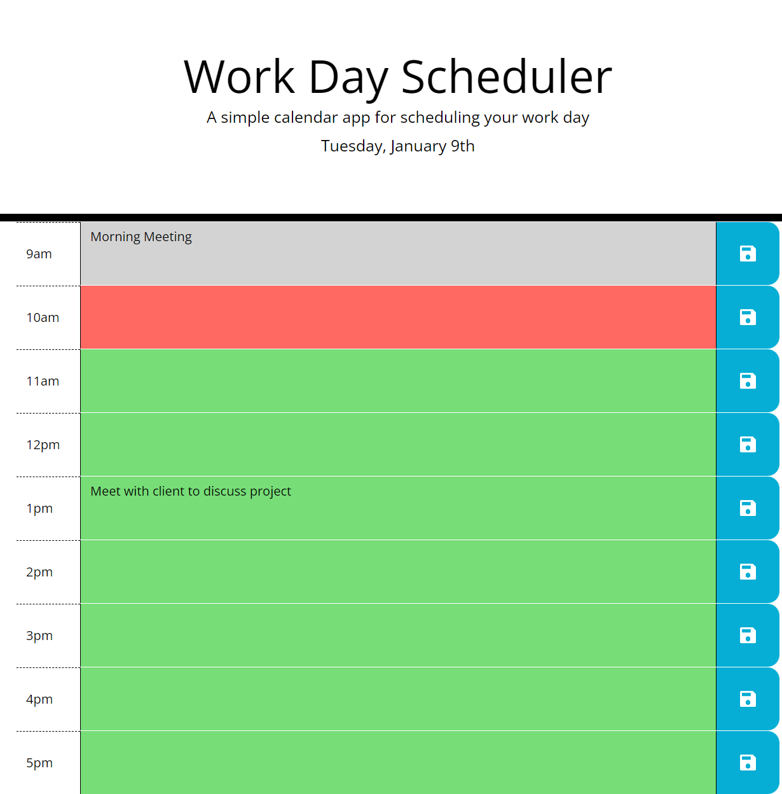

# Daily Planner

## Description 

Featuring dynamically updated HTML and CSS powered by jQuery

Project to create a Work Day Scheduler to keep track of work events during the day, allowing the user to improve organisation and efficiency. The scheduler runs in the browser and features dynamically updated HTML and CSS, powered by jQuery. 

HTML and CSS starter code was provided so I was required to create and organise JavaScript files in the most appropriate manner. I used DOM manipulation to create the content needed and assign attributes, to then manipulate, to ensure the scheduler worked correctly. Day.js  has also been incorporated into the project for dates and time functionality. 

On completion of this project I have developed my knowledge of using local storage to save and retrieve data, along with the use of third-party API’s. I have worked on considering and combining differing JavaScript techniques to create the project using clean, readable code. 

## Installation

N/A

## Usage

Open in the browser, input events in the correct time slot as needed and click save button. Events are saved and will remain on refresh or closing the window. Remove by deleting and clicking save button

https://clairepricegithub.github.io/daily-planner/

## Credits

index.js lines 167-186:  
Stack Overflow. 2012, July 2. *Return index of greatest value in an array*. https://stackoverflow.com/questions/11301438/return-index-of-greatest-value-in-an-array

## License

Please refer to the LICENSE in the repo